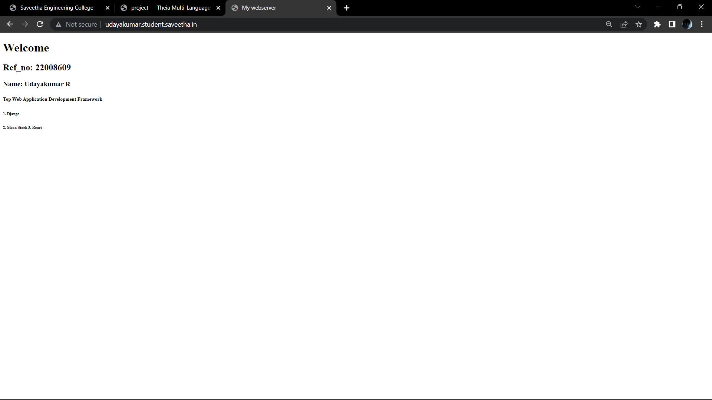

# Developing a Simple Webserver

# AIM:

Develop a webserver to display about top five web application development frameworks.

# DESIGN STEPS:

## Step 1:

HTML content creation is done

## Step 2:

Design of webserver workflow

## Step 3:

Implementation using Python code

## Step 4:

Serving the HTML pages.

## Step 5:

Testing the webserver

# PROGRAM:
```
from http.server import HTTPServer, BaseHTTPRequestHandler

content = """
<!DOCTYPE html>
<html>
<head>
<title>My webserver</title>
</head>
<body>
<h1>Welcome<h1>
<h2>Ref_no: 22008609<h2>
<h3>Name: Udayakumar R<h3>
<h4>           <h4>
<h5>Top Web Application Development Framework<h5>
<h6>1. Django<h6>
<h7>2. Mean Stack<h7>
<h8>3. React<h8>
</body>
</html>
"""
class myhandler(BaseHTTPRequestHandler):
    def do_GET(self):
        print("request received")
        self.send_response(200)
        self.send_header('content-type', 'text/html; charset=utf-8')
        self.end_headers()
        self.wfile.write(content.encode())
server_address = ('',80)
httpd = HTTPServer(server_address,myhandler)
print("my webserver is running...")
httpd.serve_forever()
```

# OUTPUT:



# RESULT:

The program is executed succesfully
